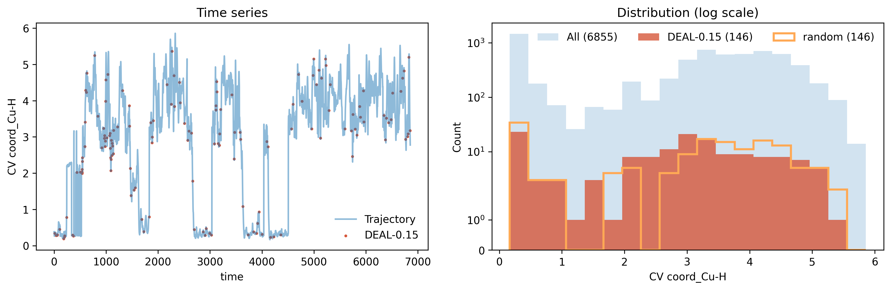
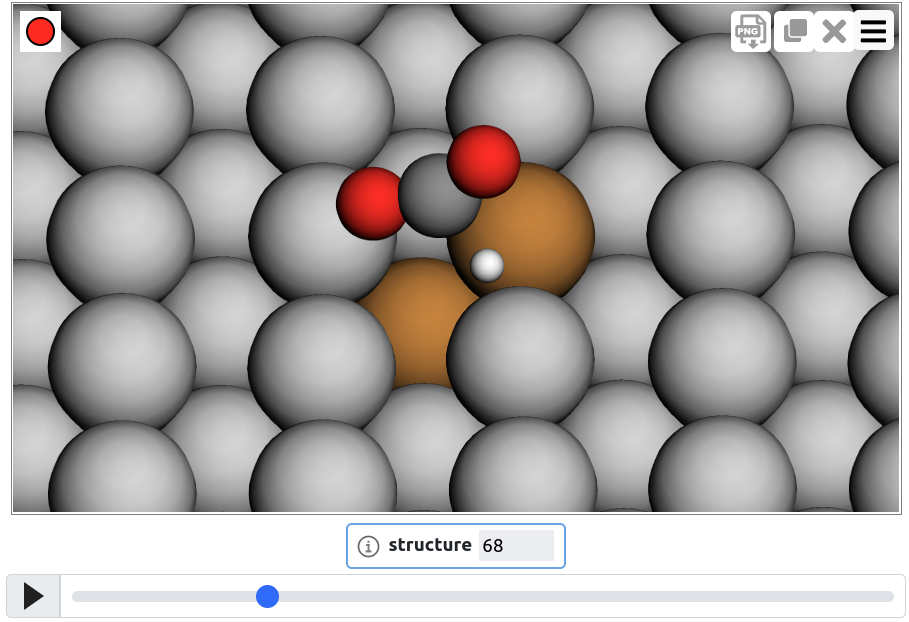
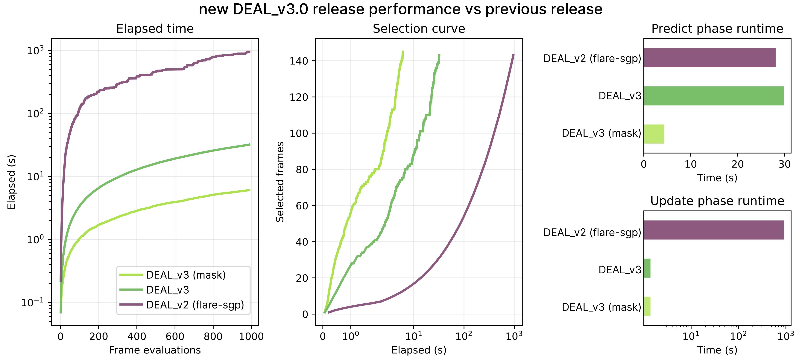

# **DEAL**

**Data Efficient Active Learning for Machine Learning Potentials**

> Reference: **Perego S. & Bonati L.**
> *Data efficient machine learning potentials for modeling catalytic reactivity via active learning and enhanced sampling*,
> **npj Computational Materials 10, 291 (2024)**
> doi: [10.1038/s41524-024-01481-6](https://doi.org/10.1038/s41524-024-01481-6)

DEAL selects non-redundant structures from atomistic trajectories via sparse Gaussian processes (SGP), to be used to train machine-learning interatomic potentials.

It consists of two steps:
1. preselect configurations using MLP uncertainty (e.g. maximum uncertainty obtained with query-by-committee)
2. select a dataset of non-redundant configurations using the local predictive variance of a Gaussian process

In addition, step 2 can also be used to subsample a trajectory without uncertainty preselection (see the [tutorials](tutorials/README.md)).

A short practical [introduction](DEAL.md) describes the main ingredients (SGP, local descriptors, uncertainty).

## Code highlights

* Select structures based on SGP predictive variance. 
* Analyze selected structures (e.g. along the trajectory or as a function of a CV)

    
* Interactive visualization using [chemiscope](https://chemiscope.org/)

    <a href="https://chemiscope.org/?load=https://raw.githubusercontent.com/luigibonati/DEAL/refs/heads/main/tutorials/2_subsampling_formate/b_selection/deal_0.15_chemiscope.json.gz"> </a>

---

## Release highlights

The latest DEAL release includes a self-contained sparse-GP backend with only
the minimal operations required by the active-learning workflow. This backend is
implemented in DEAL's native extension and substantially improves GP update
times compared with the previous DEAL release, which relied on a separate
native FLARE installation.



DEAL can also restrict GP evaluation to the atomic environments that are
relevant for selection, using an MLP uncertainty criterion as a preselection
mask. This significantly reduces prediction time, especially for reactive,
interface, and defect-containing systems, where only localized regions are
typically important for the active-learning decision.

---

## Table of contents
- ✨ [Release highlights](#release-highlights)
- 📚 [Contents](#-contents)
- 🔧 [Dependencies](#-dependencies)
- 🚀 [Installation](#-installation)
- 🧪 [Usage](#-usage)
  - [Minimal example](#minimal-example)
  - [With a YAML config file](#with-a-yaml-config-file)
  - [Python usage](#python-usage)
  - [Multiple thresholds](#multiple-thresholds)
  - [Incremental selection (CLI)](#incremental-selection-cli)
- [Files](#files)
  - [Input files](#input-files)
  - [Output files](#output-files)
  - [Create a chemiscope file](#create-a-chemiscope-file)
- 🎛️ [Choice of the parameters](#choice-of-the-parameters)

---

## 📚 Contents

* **`deal/`** – The core Python package.
* **`examples/`** – Two minimal, runnable CLI and YAML examples.
* **`tutorials/`** – Four guided, realistic workflows demonstrating how DEAL works.
* **`npj_supporting_data/`** – Jupyter notebooks reproducing the full workflow described in the publication, including the use of Gaussian Process Regression for reaction-pathway exploration.
* **`tests/`** – A test suite to verify that the installation is correct and all components work as expected.

## 🔧 Dependencies

DEAL requires:

* Python 3.10 or newer (tested with Python 3.10, 3.12, and 3.14)
* DEAL's native sparse-GP extension, built during installation
* `ase`
* `pandas`
* `numpy`
* `scipy`
* `pyyaml`
* `matplotlib`
* `chemiscope` (for visualization)

---

## 🚀 Installation

DEAL is now installed as a standalone package. A separate FLARE installation is
no longer required: the minimal sparse-GP backend used by DEAL, which is based
on the native FLARE GP implementation, is now contained in DEAL's own native
extension and is built during installation.

Create the conda environment and install DEAL:

```bash
git clone https://github.com/luigibonati/DEAL.git
cd DEAL
conda env create -f environment-deal.yml
conda activate deal
python -m pip install -e . --no-build-isolation
```

The environment file leaves software versions unpinned so Conda resolves the
latest mutually compatible releases. CI uses the same file and tests it with
Python 3.10, 3.12, and 3.14.

---

##  Usage

DEAL can be run either with the command-line tool (`deal`) or with the Python class (`DEAL`).

---


###  Minimal example

```bash
deal --file traj.xyz --threshold 0.1
```

or run in incremental mode by targeting a number of selected frames:

```bash
deal --file traj.xyz --max 50
```

DEAL will automatically:

* detect atomic species from the first frame
* use default GP/kernel/descriptor parameters
* use default output names


### 📄 With a YAML config file

For more customization, create an `input.yaml` file. The values below match the
runtime defaults; `data.files` is the only required entry:

```bash
deal -c input.yaml
```

```yaml
data:
  files: ["traj.xyz"]     # can be a single file or a list of files
  #format: "extxyz"        # file format (e.g. extxyz, xyz, ...)
  #index: ":"              # frame selection [see ASE notation]
  #shuffle: false          # whether to shuffle the frames before processing 
  #seed: 24              # random seed used when shuffle is true

# Optional: derive the candidate mask in memory from an existing per-atom
# uncertainty array. This avoids writing an intermediate masked trajectory.
#preprocessing:
#  key: force_std_comp_max
#  mask_threshold: 0.05    # omit for automatic thresholds (recommended)
#  mode: above              # above, below, between, or outside
#  mask_key: deal_mask
#  mask_upper_threshold: 0.10 # required for between/outside
#  plot: true               # true, false, or an output filename
#  output: traj_preprocessed.xyz # optional; also honored by `deal -c`
#  selected_frames_only: false # write only frames containing selected atoms
#  overwrite: false         # preserve an existing output by default

deal:
  threshold: 1.0          # standard mode: scalar or list of values
  # OR
  #max_selected: 50       # incremental mode: mutually exclusive with `threshold`
  #max_iterations: 10     # max iterations for incremental mode
  #threshold_factor: 0.7  # threshold_i = threshold_factor**(i+1)
  
  update_threshold: null # if not set it is chosen as 0.8 * threshold
  max_atoms_added: 0.2    # limit selected environments added per configuration: integer count, fraction in (0,1), or -1 for no limit
  mask: null              # auto: preprocessing mask if configured; otherwise all atoms
  initial_atoms: null     # specify which atoms to use for GP initialization (list, fraction or number. Default: null, 1 atom per species)
  output_prefix: deal     # prefix for output files
  force_only: true
  train_hyps: false       # whether to retrain hyperparameters at each iteration (slower)
  verbose: false          # allowed values: true/false/"debug"
  save_gp: false
  save_full_trajectory: false  # if true, writes <prefix>_trajectory_uncertainty.xyz with per-atom array "atomic_uncertainty"

sgp:
  gp: SGP_Wrapper
  kernels:
    - name: NormalizedDotProduct
      sigma: 2 
      power: 2
  descriptors:
    - name: B2
      nmax: 8
      lmax: 3
      cutoff_function: cosine
      radial_basis: chebyshev
  cutoff: 4.5
  
```

When `variance_type: local`, `train_hyps: false`, and `save_gp: false`, DEAL
automatically uses a local-uncertainty fast path. Local uncertainty depends only
on the sparse-environment covariance matrix, so training labels, `Kuf`, posterior
mean, and QR updates are skipped. Set `save_gp: true` or `train_hyps: true` when
a complete trainable/predictive GP model is required.

If you want to restrict DEAL to atoms selected by an external uncertainty
estimate, prepare the trajectory first with `deal-mask`:

```bash
deal-mask \
  -f traj_with_uncertainty.xyz \
  -o traj_with_deal_mask.xyz \
  -k force_std_comp_max \
  --mask-threshold 0.05 \
  --mode above \
  --mask-key deal_mask
```

Then run DEAL on `traj_with_deal_mask.xyz` with `deal.mask: true`.

`deal-mask` can read the same YAML used by `deal`:

```bash
deal-mask -c input.yaml
```

It reads the complete `data:` and `preprocessing:` blocks. Command-line
arguments override their YAML counterparts. If `preprocessing.output` is not
set, the output defaults to `<input_stem>_preprocessed<input_suffix>`.

The same preprocessing can be performed as part of a normal DEAL run:

```yaml
data:
  files: ["traj_with_uncertainty.xyz"]
preprocessing:
  key: force_std_comp_max
  mask_key: deal_mask
  plot: true
  output: traj_with_deal_mask.xyz
  overwrite: false
deal:
  threshold: 0.1
  mask: true
```

When `mask_threshold` is omitted, DEAL follows the automatic preprocessing
rule: it computes the mean of the maximum per-atom uncertainty in each frame,
selects frames whose maximum lies between
`1.1` and `4.0` times that mean, and selects atoms above `0.3` times their
frame's maximum. These constants can be changed with `lower_factor`,
`upper_factor`, and `mask_fraction`.

During the initial stage of active learning, query-by-committee uncertainty may
not yet be reliable because the committee has been trained on limited data. For
a safer, broader preselection in this regime, reduce `lower_factor` to a value
in the `0.5–0.9` range and `upper_factor` to a value in the `1.5–3.0` range.
Reassess these factors as the training set grows and the uncertainty estimates
become better calibrated.

`plot` defaults to `true` and writes `preprocessing_selection.png`. Set it to
`false` to disable plotting or to a filename such as
`plots/my_preselection.png`. The plot compares all and selected atom/frame
uncertainty distributions and shows the automatic frame thresholds.

`output` optionally saves the masked trajectory from either `deal -c` or
`deal-mask -c`. Existing files are preserved by default; set `overwrite: true`
or pass `deal-mask --overwrite` to replace one. This makes repeated DEAL runs
safe while retaining a reusable preprocessed trajectory when requested.

By default, the output contains every input frame and stores the selection in
the per-atom mask. Set `selected_frames_only: true` in `preprocessing:` or pass
`deal-mask --selected-frames-only` to write only frames containing at least one
selected atom.

CLI equivalents are `--preprocess-key`, `--preprocess-mask-threshold`,
`--preprocess-mode`, `--preprocess-mask-upper-threshold`, and
`--preprocess-plot`.
The mask is added to the loaded frames in memory, so no intermediate trajectory
is written.

One can also use a base config file and override via CLI the options:
```bash
deal -c input.yaml -t 0.15
deal -c input.yaml --max-selected 50
deal -c input.yaml --mask false
```

### Python Usage

```python
# Import 
from deal import DataConfig, DEALConfig, SGPConfig, DEAL

# Define Config (uses defaults where not provided)
data_cfg = DataConfig(files="traj.xyz")
deal_cfg = DEALConfig(
    threshold=1.0,
)
sgp_cfg = SGPConfig()

# Instantiate DEAL class
deal = DEAL(data_cfg, deal_cfg, sgp_cfg)

# Run 
deal.run()

```

### Multiple thresholds

If the CLI receives a list of thresholds, DEAL will run once per threshold
(standard mode only).
```yaml
deal:
  threshold:
    - 0.10
    - 0.15
    - 0.20
```

Equivalent behavior in Python:

```python
for thr in [0.10, 0.15, 0.20]:
    deal_cfg.threshold = thr
    deal_cfg.output_prefix = f"run_thr{thr}"
    DEAL(data_cfg, deal_cfg, sgp_cfg).run()
```

### Incremental selection (CLI)

Use incremental mode when you want to select up to a target number of structures.

```yaml
deal:
  max_selected: 50
  max_iterations: 10
  threshold_factor: 0.7
```

At each iteration `i` (starting from 1), the threshold is decreased as:

`threshold_i = threshold_factor**i`

The run stops when one of these conditions is met: either selected structures reach `max_selected` or `max_iterations` is reached.

Note: `threshold` and `max_selected` are mutually exclusive in the CLI.

## Files

### Input files

As explained in the [introduction](DEAL.md), DEAL builds a model for energy and forces using a sparse Gaussian process, although this is used only as a proxy for uncertainty. For this reason, DEAL expects to receive a trajectory as input, for example stored in an .extxyz file, containing both energies and forces. However, since the predictive uncertainty does not depend on the labels, these do not need to be recalculated at the DFT level; in fact, they could be obtained by evaluating the trajectory with an ML potential.

### Output files

In both cases the following file is generated (with the default `output_prefix=deal`):

1. **`deal_selected.xyz` – selected frames** 

Contains the atomic configurations where the GP uncertainty exceeded the threshold.
Includes atoms.info["original_frame"] indicating the original trajectory index.
If `save_gp: true`, DEAL also writes:
2. **`deal_sgp.json` – final GP model**

If `save_full_trajectory: true`, DEAL also writes:
3. **`deal_trajectory_uncertainty.xyz` – full trajectory with uncertainties**

They both contain:
- per-atom array `atomic_uncertainty` (saved in `atoms.arrays`)
- frame scalar `max_atomic_uncertainty` (saved in `atoms.info`)

By default, `mask: null` uses the mask produced by the `preprocessing` section;
without preprocessing, every atom is eligible. If `deal.mask` is enabled
explicitly, DEAL reads a per-atom mask array from the trajectory.
`mask: true` uses the default `deal_mask` array created by `deal-mask`; a string
value uses that custom array name. Atoms with zero/false mask values are excluded
from GP uncertainty prediction and written with `atomic_uncertainty = -1.0`.
Frames with no eligible atoms are skipped. If `mask: false`, every atom is
eligible.

With the B2 descriptor, masked prediction and local GP updates construct native
neighbor lists and descriptors only for eligible central atoms. All atoms remain
available as neighbors, so masked results are identical to filtering the full
calculation while the descriptor cost scales with the number of candidates.

### Create a chemiscope file

After running `deal`, one can create a chemiscope visualization file with:

```bash
deal-chemiscope --prefix deal
```

or explicitly with the trajectory file and optionally also a COLVAR file:

```bash
deal-chemiscope --trajectory deal_selected.xyz --colvar COLVAR
```

`deal-chemiscope` creates a chemiscope visualization file from the selected structures.
The file includes all numeric properties available in `atoms.info` for each frame, and,
when `--colvar` is provided, it also includes the properties loaded from the COLVAR file.

This writes `deal_chemiscope.json.gz` (by default with `--prefix deal`).
It can be viewed online at https://chemiscope.org/ or inside Python:
```python
import chemiscope
chemiscope.show_input('deal_chemiscope.json.gz')
```
See also the Chemiscope [documentation](https://chemiscope.org/docs/).


## 🎛️ Choice of the parameters

Below is a quick guide; see the [introduction](DEAL.md) for a more in-depth explanation.

**Descriptors**

Local environments are characterized via the Atomic Cluster Expansion formalism in DEAL's native SGP backend. Key hyperparameters: body order (`B1/B2`), radial degree `nmax`, angular degree `lmax`, and `cutoff` (in Å).

```yaml
  descriptors:
    - name: B2
      nmax: 8
      lmax: 3
      cutoff_function: cosine
      radial_basis: chebyshev
  cutoff: 4.5
```      

**Threshold**
```yaml
  threshold: 0.1
  update_threshold: 0.08  # if not set it is chosen as 0.8 * threshold      
  max_atoms_added: -1 # no limit on the number of selected environments added from a given configuration to the GP.
  initial_atoms: 0.15 # use up to 15% of the atoms (of each species) for GP initialization
  mask: null # preprocessing mask if configured; otherwise all atoms
```      

The `threshold` parameter in the DEAL configuration controls when a local environment is flagged by the SGP’s predictive variance (normalized by the noise hyperparameter). If any environment exceeds the threshold, the GP is updated and that environment (plus any others above `update_threshold`, up to `max_atoms_added`) is added.

Some tips:

- The uncertainty values are unitless and range between 0 and 1. Lower threshold means more selected structures; higher threshold, fewer selections.
- A good starting point is around 0.1. As a rule of thumb, homogeneous, condensed and/or crystalline systems tend to have fewer different local environments and require smaller thresholds (<<0.1), whereas heterogeneous systems may require larger ones (>0.1). This is also connected with the number of species (more species -> higher threshold required).
- Try a few values and compare how many structures are selected; distributions often are very similar across thresholds, what changes is the number of structures. One can decide based on the computational budget (for DFT calculations).
- The recommended strategy is **incremental selection**: start with a high threshold, then decrease it progressively until a target number of structures is reached. This is easily achieved with the CLI by setting `max_selected` (or `--max-selected`; see the [minimal examples](examples/README.md) and [Tutorial 4](tutorials/4_incremental_selection/README.md)).
- Use chemiscope/OVITO to visualize the selected structures and identify which environments triggered selection. 

Note: the training time scales unfavorably with the number of samples. For a large dataset, it is advised to divide it into chunks, run DEAL separately on each chunk, and then perform a second DEAL selection on the output structures.
