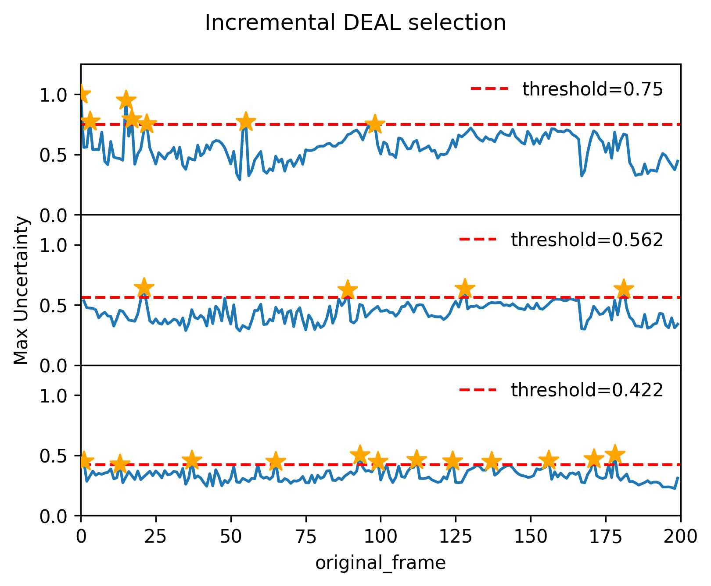

## Incremental selection 

In addition to the standard mode, which requires specifying a threshold, DEAL can also run in incremental mode, using multiple iterations with progressively
lower thresholds, so you can stop when a target number of selected structures is reached instead of picking a single threshold upfront.



### Run incremental DEAL with CLI

Incremental selection is now integrated in the CLI.

Run directly with defaults (`max_iterations=10`, with a decay `threshold_factor=0.7`):

```bash
deal --file input/fcu_ev5.xyz.gz --max-selected 20
```

**Output example**
```
[DEAL] Running in incremental mode with max_selected = 20.

[DEAL] Iteration 1 (threshold: 0.7)
[DEAL] Examined:   200 | Selected:     8 | Speed:   0.43 s/step | Elapsed:    99.06 s
[DEAL] New selected: 8 

[DEAL] Iteration 2 (threshold: 0.49)
[DEAL] Examined:   192 | Selected:    12 | Speed:   0.43 s/step | Elapsed:   199.18 s
[DEAL] New selected: 4 

[DEAL] Iteration 3 (threshold: 0.343)
[DEAL] Examined:   188 | Selected:    24 | Speed:   0.44 s/step | Elapsed:   378.14 s
[DEAL] New selected: 12 

[DEAL] Stopping incremental mode: max_selected is reached.
```

### Customize input

If you want to customize the settings, create a YAML file `input.yaml`:

```yaml
data:
  files: "input/fcu_ev5.xyz.gz"
  shuffle: true
  seed: 42

deal:
  max_selected: 20
  max_iterations: 10
  threshold_factor: 0.7
  output_prefix: "deal_incremental"
```

and run: 

```bash
deal -c input.yaml
```

### Deprecated Python script

This functionality was first implemented as an example in `incremental_DEAL.py`. This is kept as a legacy example showing how to implement incremental selection manually with `configure_run(...)` and analyze the result in more detail.
